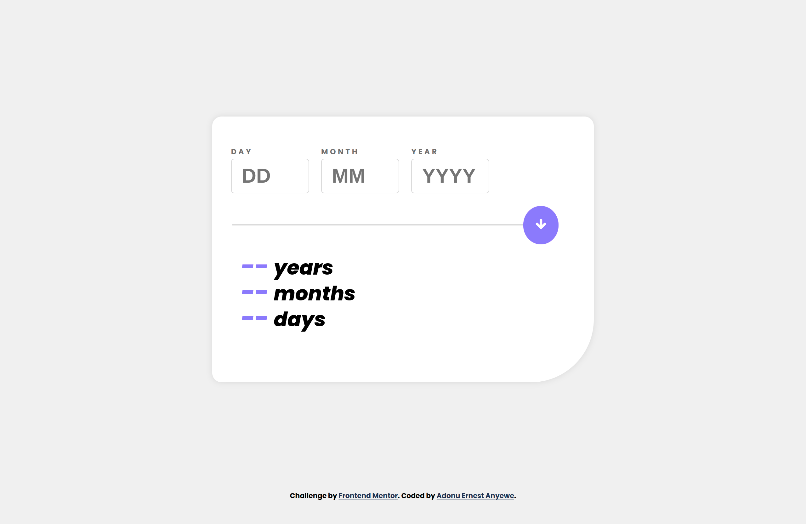
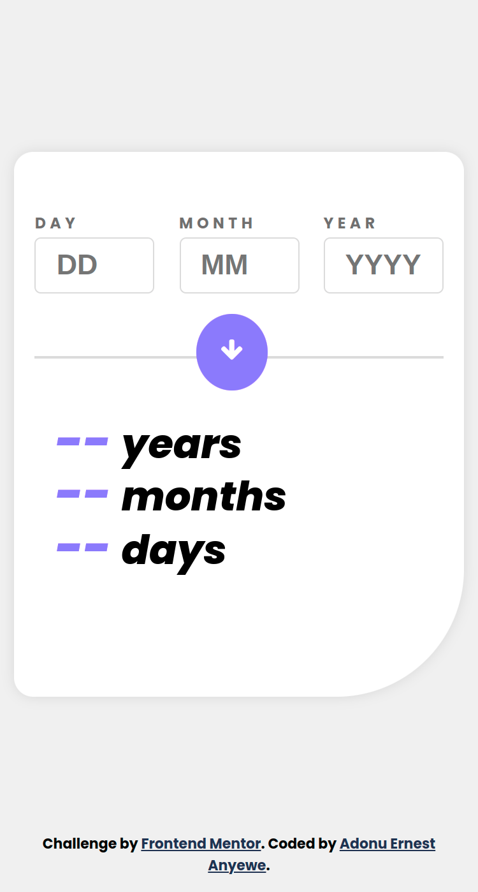

# Frontend Mentor - Age calculator app solution

This is a solution to the [Age calculator app challenge on Frontend Mentor](https://www.frontendmentor.io/challenges/age-calculator-app-dF9DFFpj-Q). Frontend Mentor challenges helps to improve one's coding skills by building realistic projects.

## Table of contents

- [Overview](#overview)
  - [The challenge](#the-challenge)
  - [Screenshot](#screenshot)
  - [Links](#links)
- [My process](#my-process)
  - [Built with](#built-with)
  - [What I learned](#what-i-learned)
  - [Continued development](#continued-development)
  - [Useful resources](#useful-resources)
- [Author](#author)
- [Acknowledgments](#acknowledgments)
- [License](#license)

## Overview

### The challenge

Users would be able to:

- View an age in years, months, and days after submitting a valid date through the form
- Receive validation errors if:
  - Any field is empty when the form is submitted
  - The day number is not between 1-31
  - The month number is not between 1-12
  - The year is in the future
  - The date is invalid e.g. 31/04/1991 (there are 30 days in April)
- View the optimal layout for the interface depending on their device's screen size
- See hover and focus states for all interactive elements on the page
- See the age numbers animate to their final number when the form is submitted

### Screenshot


### Links

- Solution URL: [GitHub solution](https://github.com/principlebrothers/Age-calculator)
- Live Site URL: [Age Calulator Live](https://age-calculator-app-main-nu.vercel.app/)

## My process

### Built with

- Semantic HTML5 markup
- CSS custom properties
- Flexbox
- Mobile-first workflow

### What I learned

```html
<h1>The HTML code I'm proud of is using the <b>role</b> and <b>aria-labelledby</b> for accessibility</h1>

<div class="form__control" role="group" aria-labelledby="day-label"></div>
```

```css
/*I am proud of this css below*/
  input::-webkit-outer-spin-button,
  input::-webkit-inner-spin-button {
  -webkit-appearance: none;
  margin: 0;
  }

  input[type='number'] {
    -moz-appearance: textfield;
  }
```

```js
const proudOfThisFunc = () => {
  console.log('The function organization and the implementation of Single Responsibility principle is what I am proud. 🎉')
}
```

### Continued development

- Breaking the code into modules
- Implement DRY principle
- Implemnt KISS principle

### Useful resources

- [W3 Schools Online schools](https://www.w3schools.com/) - This helped me for accessiblity implementation.

## Author

- Website - [Ernest Anyewe Adonu](https://eaadonu-principlebrothers.vercel.app)
- Frontend Mentor - [@principlebrothers](https://www.frontendmentor.io/profile/principlebrothers)
- Twitter - [@adonu_ernest](https://twitter.com/adonu_ernest)

## Acknowledgments

I want to appreciate GitHub and Vercel for the opportunity to host and deploy this work on their highly esteemed plateforms

- [GitHub](https://github.com/)
- [Vercel](https://vercel.com/)

## License

This project is [MIT](./LICENSE) licensed.
